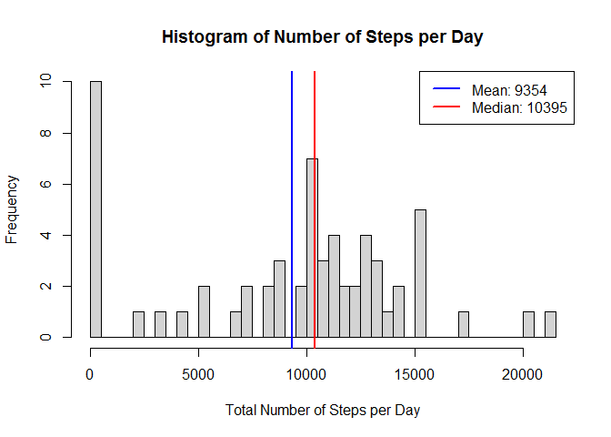
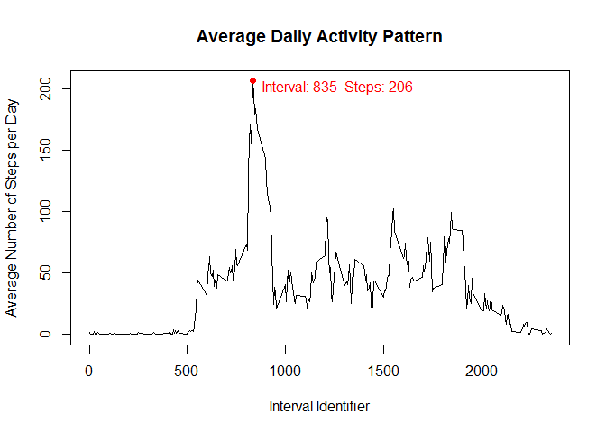
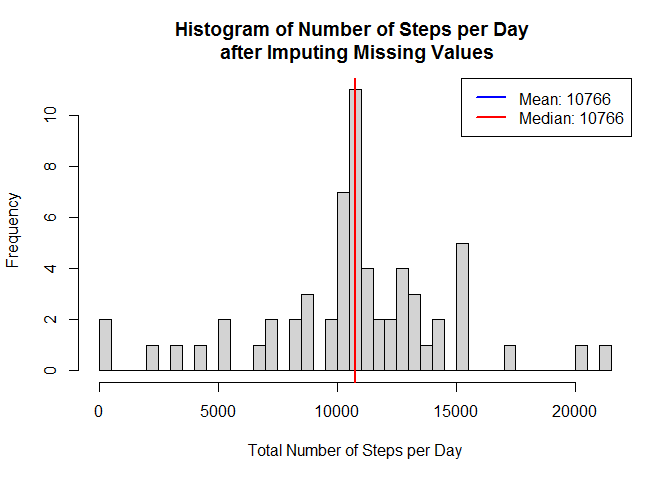
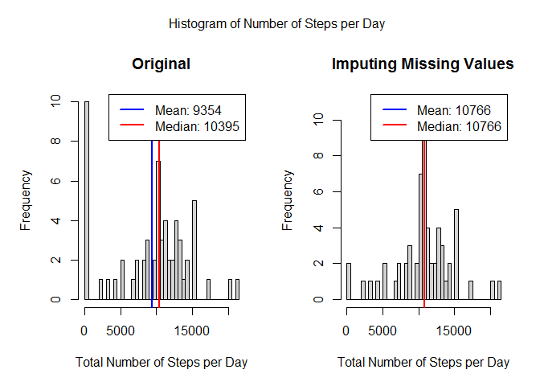
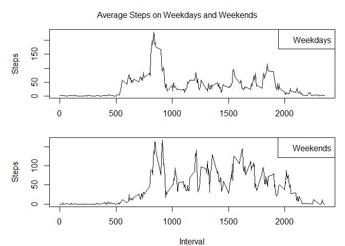

    The objective of this project is to analyze the data about personal movement recorded by many individuals using activity monitoring devices such as Fitbit, Nike, Fuelband, or Jawbone Up.

## Loading and preprocessing the data

The data is stored in a csv file named *activity.csv*. It is loaded into Rstudio.

It contains 3 variables, namely *steps*, *date*, and *interval*. The only processing done on the data is that the *date* variable, which initially was a 'character' class, is converted to 'POSIXct' class.


```r
data<-read.csv("activity.csv")
data$date<-as.POSIXct(data$date)
head(data)
```

```
##   steps       date interval
## 1    NA 2012-10-01        0
## 2    NA 2012-10-01        5
## 3    NA 2012-10-01       10
## 4    NA 2012-10-01       15
## 5    NA 2012-10-01       20
## 6    NA 2012-10-01       25
```

## What is mean total number of steps taken per day?

We start this section by creating a function *steptotal()*, because the same plot is once again asked for in a later section.


```r
steptotal<-function(dframe,Title){
    total_steps<-aggregate(dframe$steps,list(dframe$date),function(n) sum(n,na.rm=TRUE))
    names(total_steps)<-c("Date","Steps")
    step_mean<-round(mean(total_steps$Steps))
    step_median<-round(median(total_steps$Steps))
    hist(total_steps$Steps,breaks=61,xlab="Total Number of Steps per Day",
        main=Title)
    abline(v=step_mean,col="blue",lw=2)
    abline(v=step_median,col="red",lw=2)
    legend("topright",lw=2,col=c("blue","red"),
        legend=c(paste("Mean:",step_mean),paste("Median:",step_median)))
}
```

The above function takes a dataframe and a character as argument, and gives back a histogram plot of the mean total steps per day. The character argument provided is displayed as the title to the plot.


```r
steptotal(data,"Histogram of Number of Steps per Day")
```

<!-- -->

## What is the average daily activity pattern?

A new data set named *average_steps* is created, which contains the mean of the steps (ignoring the missing values) over the 2 months period, according to intervals.


```r
average_steps<-aggregate(data$steps,list(data$interval),function(n)mean(n,na.rm = TRUE))
names(average_steps)<-c("Interval",'Steps')
head(average_steps)
```

```
##   Interval     Steps
## 1        0 1.7169811
## 2        5 0.3396226
## 3       10 0.1320755
## 4       15 0.1509434
## 5       20 0.0754717
## 6       25 2.0943396
```

Using this *average_steps* data, we create a plot showing the daily activity pattern on average.


```r
i<-which(average_steps$Steps==max(average_steps$Steps))
plot(average_steps$Interval,average_steps$Steps,type="l",xlab="Interval Identifier",
    ylab="Average Number of Steps per Day",main="Average Daily Activity Pattern")
points(average_steps[i,1],average_steps[i,2],col="red",pch=19)
text(x=average_steps[i,1]+5,y=average_steps[i,2]-5,pos=4,col="red",
     paste("Interval:",average_steps[i,1]," Steps:",round(average_steps[i,2])))
```

<!-- -->

As we can see from the plot, the maximum activity is on average on the *835th* interval, with approximately *206* steps.

## Imputing missing values


```r
head(data)
```

```
##   steps       date interval
## 1    NA 2012-10-01        0
## 2    NA 2012-10-01        5
## 3    NA 2012-10-01       10
## 4    NA 2012-10-01       15
## 5    NA 2012-10-01       20
## 6    NA 2012-10-01       25
```

As we can see there are missing values in the *steps* variable in the data set *data*. To be exact, there are *2304* missing values.

We replace the missing values with the data from *average_steps* data set, according to the *interval* variable. Let us store the new data set as *data_new*.


```r
i<-which(is.na(data$steps))
data_new<-data
for(x in i) data_new$steps[x]<-average_steps$Steps[which(average_steps$Interval==data_new$interval[x])]
head(data_new)
```

```
##       steps       date interval
## 1 1.7169811 2012-10-01        0
## 2 0.3396226 2012-10-01        5
## 3 0.1320755 2012-10-01       10
## 4 0.1509434 2012-10-01       15
## 5 0.0754717 2012-10-01       20
## 6 2.0943396 2012-10-01       25
```

We can now create a histogram showing the mean total steps per day in the new data set.


```r
steptotal(data_new,"Histogram of Number of Steps per Day \n after Imputing Missing Values")
```

<!-- -->

We can now compare the two data sets, the original and *data_new*, and see how the two differ.


```r
par(mfrow=c(1,2),oma=c(0,1,2,0))
steptotal(data,"Original")
steptotal(data_new,"Imputing Missing Values")
mtext("Histogram of Number of Steps per Day",outer=TRUE)
```

<!-- -->

We see that the plot itself does not change significantly, but the mean and median of total steps per day do differ.

## Are there differences in activity patterns between weekdays and weekends?

We introduce a new variable *Weekday_Factor* in the new data set, which is a factor variable having two levels, *Weekday* and *Weekend*, according to the day of the week the corresponding *date* variable signifies.


```r
w<-weekdays(data_new$date)
Weekday_Factor<-vector(mode="character",length=length(w))
for(i in 1:length(w)){
    if(w[i]=="Saturday"|w[i]=="Sunday") Weekday_Factor[i]<-"Weekend"
    else Weekday_Factor[i]<-"Weekday"
}
data_new<-cbind(data_new,Weekday_Factor)
data_new$Weekday_Factor<-as.factor(data_new$Weekday_Factor)
head(data_new)
```

```
##       steps       date interval Weekday_Factor
## 1 1.7169811 2012-10-01        0        Weekday
## 2 0.3396226 2012-10-01        5        Weekday
## 3 0.1320755 2012-10-01       10        Weekday
## 4 0.1509434 2012-10-01       15        Weekday
## 5 0.0754717 2012-10-01       20        Weekday
## 6 2.0943396 2012-10-01       25        Weekday
```

Next we create a plot showing the average steps at each interval for weekdays and weekends.


```r
dw<-subset(data_new,Weekday_Factor=="Weekday")
weekday_av<-aggregate(dw$steps,list(dw$interval),function(n)mean(n,na.rm = TRUE))
names(weekday_av)<-c("Interval",'Steps')

dw<-subset(data_new,Weekday_Factor=="Weekend")
weekend_av<-aggregate(dw$steps,list(dw$interval),function(n)mean(n,na.rm = TRUE))
names(weekend_av)<-c("Interval",'Steps')

par(mfrow=c(2,1),oma=c(0,1,3,0),mar=c(4,4,0,1))
plot(weekday_av$Interval,weekday_av$Steps,xlab="",ylab="Steps",type="l")
legend("topright",legend="Weekdays")
plot(weekend_av$Interval,weekend_av$Steps,xlab="Interval",ylab="Steps",type="l")
legend("topright",legend="Weekends")
mtext("Average Steps on Weekdays and Weekends\n",outer=TRUE)
```

<!-- -->

As it can be seen from the above plot, there is much more activity on the weekends, throughout the day.
